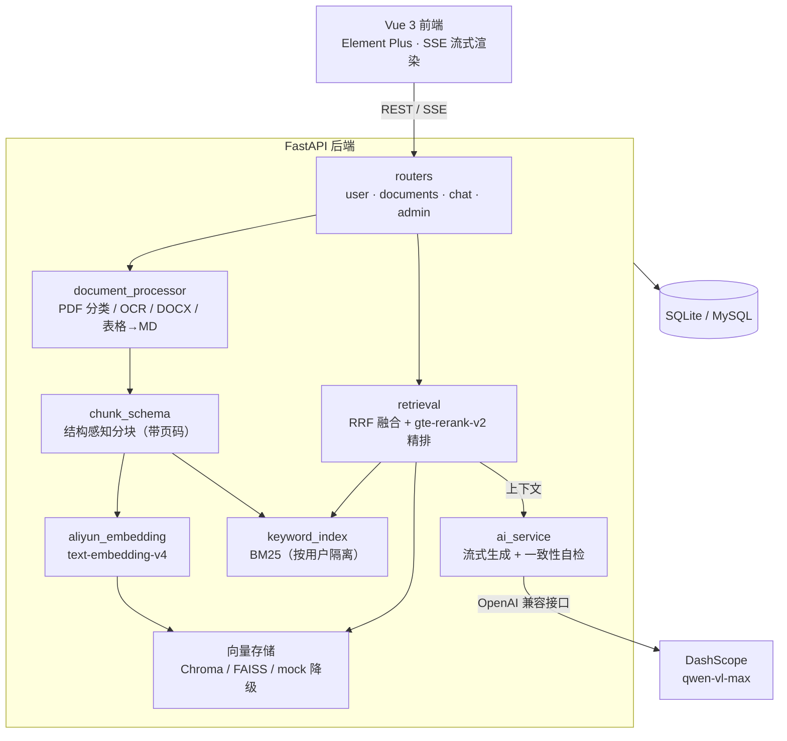

# AI RAG 知识库对话系统

     

一个**检索增强生成（RAG）知识库对话系统**：上传 PDF / DOCX / Markdown / 图片等文档构建个人知识库，AI 基于文档内容回答问题 —— 带页码溯源、无依据拒答、答案-证据一致性自检，全部回答有据可查。

支持多用户隔离、管理后台、用户自带模型配置（BYOK），并提供 RAG 检索质量评测工具。

## ✨ 核心特性

### 文档处理管线

- **PDF 智能解析**：PyMuPDF 逐页按文字量/图片覆盖率分类为原生文本页、扫描页、混合页；扫描页渲染后走 OCR 兜底，混合页对大图做 OCR；表格用 `find_tables` 转 Markdown；双栏页按栏恢复阅读顺序
- **DOCX 结构遍历**：按正文顺序遍历段落与表格，标题样式识别为小节，表格转 Markdown
- **结构感知分块**：按页/小节聚合、句子边界切分，chunk 携带 `page_number` / `section` 元数据入库，**回答可溯源到原文页码**
- **上传防重**：流式计算 SHA-256 文件哈希，同用户重复文件直接拦截（409）

### 混合检索与质量闭环

- **双路召回**：语义向量检索（Chroma / FAISS 可切换，失败自动降级 mock）+ BM25 关键词检索（rank-bm25），各召回 `RAG_RECALL_K` 条
- **RRF 融合 + 精排**：Reciprocal Rank Fusion 融合双路结果，可选调用 DashScope `gte-rerank-v2` 重排
- **相关性阈值过滤**：低于 `RAG_RELEVANCE_THRESHOLD` 的证据直接过滤，**无可用证据时明确拒答而非编造**
- **检索为空自动改写**：LLM 改写查询后重试一次（`RAG_QUERY_REWRITE_ENABLED`）
- **答案-证据一致性自检**：生成后做一次自检（`RAG_VERIFY_ENABLED`），不通过则追加一次严格依据证据的修正生成；SSE 事件流新增 `quality` 事件
- **强制溯源**：RAG prompt 要求回答标注来源（文档名 · 页码）

### 产品能力

- **两种对话模式**：`free`（模型直接回答）/ `rag_selected`（基于勾选文档检索回答）
- **多用户隔离**：JWT 认证（bcrypt 加密 + 访问/刷新双令牌），向量集合与 BM25 索引按用户隔离
- **管理后台**：用户/文档管理仪表盘（Dashboard / Admin）
- **自带模型配置（BYOK）**：用户可配置自己的 API Key 与模型（`UserAIConfig`）
- **SSE 流式输出**：打字机效果 + Markdown 渲染（highlight.js 代码高亮 + DOMPurify 消毒）
- **RAG 评测工具**：`tools/rag_eval.py` 基于 JSON 问答集评估检索 hit_rate / 相似度并生成报告，可加 `--answer` 同步生成答案

## 🏗️ 系统架构



## 🛠️ 技术栈

| 层 | 技术 |
| --- | --- |
| 后端 | Python 3.13、FastAPI、SQLAlchemy 2.0、Pydantic v2 + pydantic-settings |
| 认证 | JWT（python-jose）+ passlib/bcrypt，访问 + 刷新双令牌 |
| 向量存储 | ChromaDB（默认）/ FAISS / mock（自动降级），Embedding：DashScope `text-embedding-v4` |
| 关键词检索 | rank-bm25（按用户持久化索引） |
| 文档解析 | PyMuPDF、pdfplumber、python-docx、Pillow、OCR（DashScope 多模态模型） |
| 精排 | DashScope `gte-rerank-v2` |
| 前端 | Vue 3、Vite、Pinia、Vue Router、Element Plus、Vant、markdown-it/marked + highlight.js + DOMPurify |

## 📁 项目结构

```
ai-rag-chat/
├── backend/                        # FastAPI 后端
│   ├── main.py                     # 入口（CORS、自动建表、schema 迁移）
│   ├── config.py                   # Settings 集中配置（.env 覆盖）
│   ├── routers/                    # user / documents / chat / admin
│   ├── services/                   # 文档解析、分块、向量库、混合检索、AI 服务
│   ├── tools/rag_eval.py           # RAG 检索质量评测脚本
│   ├── models.py / schemas.py      # ORM 与 Pydantic 模型
│   ├── auth.py / database.py       # JWT 认证与数据库基建
│   └── Dockerfile / .env.example
├── frontend/                       # Vue 3 前端
│   ├── src/views/                  # Landing / Chat / Documents / Dashboard / Admin / Settings
│   ├── src/api/ · store/ · router/
│   └── Dockerfile
├── start.py / start.bat            # 一键启动（后端 8000 + 前端 5173）
└── README.md
```

## 🚀 快速开始

### 方式一：一键启动（Windows）

```bat
:: 双击 start.bat，或：
python start.py
```

自动使用 `backend/.venv`（不存在则用系统 Python），分别在 **8000**（后端）与 **5173**（前端）启动服务。

### 方式二：手动启动

```bash
# 后端
cd backend
python -m venv .venv
.venv\Scripts\pip install -r requirements.txt
copy .env.example .env            # 填入 API Key 后保存
.venv\Scripts\uvicorn main:app --host 127.0.0.1 --port 8000

# 前端
cd frontend
npm install
npm run dev                       # http://localhost:5173
```

### 方式三：Docker

```bash
docker build -t ai-rag-backend ./backend
docker build -t ai-rag-frontend ./frontend
```

> 首次启动自动建表；上传文档 → 系统解析分块 → 向量化入库 → 即可在聊天页勾选文档提问。

## ⚙️ 配置说明（`backend/.env`，参考 `.env.example`）

| 变量 | 说明 |
| --- | --- |
| `OPENAI_API_KEY` / `OPENAI_BASE_URL` | 对话模型走 OpenAI 兼容接口（默认阿里云百炼 DashScope） |
| `DEFAULT_MODEL` | 对话模型，如 `qwen-vl-max`（支持图片理解） |
| `IMAGE_OCR_MODEL` | 扫描页/大图 OCR 用的多模态模型 |
| `DASHSCOPE_API_KEY` / `EMBEDDING_MODEL` | 嵌入与精排（`text-embedding-v4` / `gte-rerank-v2`） |
| `SECRET_KEY` | JWT 签名密钥，**生产环境必须修改** |
| `DATABASE_URL` | 默认 SQLite；可切换 MySQL（`mysql+aiomysql://...`） |
| `VECTOR_STORE_BACKEND` | `chroma`（默认）/ `faiss` / `mock`，失败自动降级 |
| `CHUNK_*` | 分块目标长度 / 上限 / 重叠 / 最小长度 |
| `RAG_TOP_K` / `RAG_RECALL_K` / `RAG_RELEVANCE_THRESHOLD` | 最终上下文条数 / 双路召回数 / 相关性阈值 |
| `RAG_RERANK_ENABLED` / `RERANK_MODEL` | 是否启用精排及模型名 |
| `RAG_VERIFY_ENABLED` / `RAG_QUERY_REWRITE_ENABLED` | 答案自检 / 检索为空查询改写 |
| `RAG_OCR_MAX_PAGES` | 单文档 OCR 页数上限（控制成本） |
| `CORS_ALLOW_ORIGINS` | 生产环境允许的前端来源（`APP_ENV=prod` 时生效） |

## 🧪 RAG 质量评测

```bash
cd backend
python -m tools.rag_eval tools/rag_eval_cases.json           # 检索 hit_rate / 相似度报告
python -m tools.rag_eval tools/rag_eval_cases.json --answer  # 同时生成答案
```

评测集为 JSON 问答对，输出各问题的召回命中与相似度指标，用于调优分块与检索参数。

## 📄 许可证

[MIT](LICENSE)
